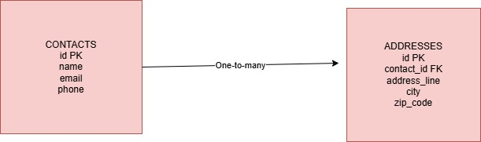

# Database-final-assignment

# 📁 Clinic Booking System & Contact Book – Database Projects

## 🔍 Overview

This project includes two SQL-based relational database designs:

1. **Clinic Booking System** – A complete medical appointment scheduling system with patient and doctor management.
2. **Contact Book** – A simplified application to store and manage contacts with their related details.

Both databases are created using **MySQL**, following normalization and relational integrity principles.

---

## 🏥 Clinic Booking System

### 📌 Description

The Clinic Booking System is designed to manage:

- Patients
- Doctors
- Appointments
- Specializations
- Departments
- Users (for login and role-based access)

It supports booking and tracking medical appointments and connects users to their roles (e.g., doctor or patient).

### 🗃️ Database Tables

- `Users` – Stores login and role info (`admin`, `doctor`, `patient`)
- `Patients` – Personal and contact info
- `Doctors` – Doctor profiles and specialties
- `Appointments` – Scheduled bookings
- `Departments` – Medical units (e.g., Cardiology)
- `Specialization` – Doctor areas of focus
- `Doctor_Specialization` – Many-to-many link between doctors and specializations

### 🔗 Relationships

- One-to-One: Users ↔ Doctors
- One-to-Many: Patients → Appointments
- One-to-Many: Doctors → Appointments
- One-to-Many: Departments → Specialization

### 📂 File Contents

- `Answers_One.sql` – Contains all `CREATE TABLE` statements and sample data
- `ClinicBookingSystem.drawio` – Visual ERD for the schema
- 
- `Screenshots` -
- 
- 
- 
- 

---

## 📇 Contact Book

### 📌 Description

A simple app to store and manage personal contacts and addresses. It also includes Node.js + Express – For building a CRUD API layer

### 🗃️ Database Tables

- `Contacts` – Name, phone, email, etc.
- `Addresses` – city, zip code etc.

### 🔗 Relationships

- One-to-Many: Contacts → Addresses

### 📂 File Contents

- `Answers_Two.sql` – Full schema and example records
- `ContactBook.drawio` – ERD diagram
- 
- `Screenshots`
- 
- 
- 
- 
- 
- 

---

## 🚀 Tech Stack

- **MySQL** – Database engine
- **Draw.io (diagrams.net)** – ERD creation
- Node.js + Express – For building a CRUD API layer

---

## 📥 How to Use

1. Open MySQL Workbench or any SQL client.
2. Run the `.sql` files to create the databases.
3. Import the `ContactBook.drawio` files in [draw.io](https://app.diagrams.net) to view ER diagrams.

---

## 📧 Author

- Mary Fiona Omondi
- Email: [omondifiona77@gmail.com](mail to: omondifiona77@gmail.com)
- GitHub: [Fiona Atieno](https://github.com/fiona12-code)

---
